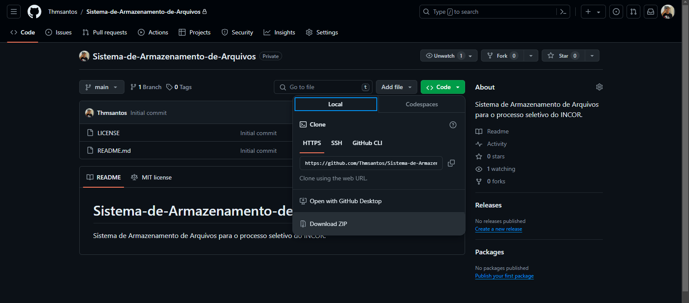
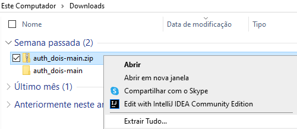
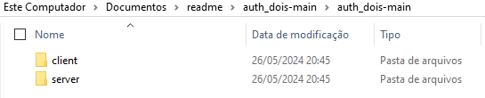
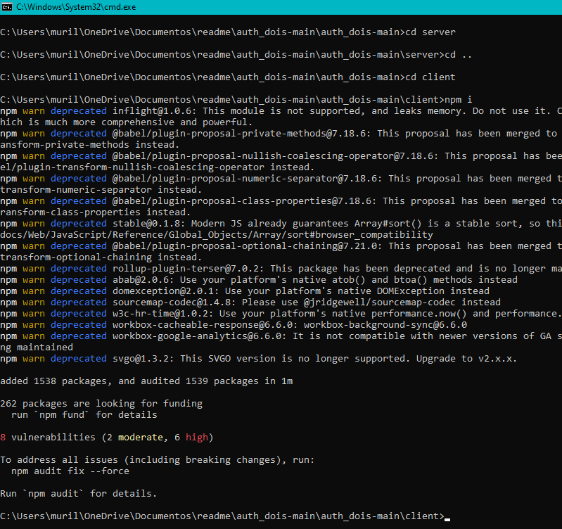

<h1>Sistema de Armazenamento de Arquivos</h1>
<h2>Autor: Thiago Messias Santos</h2>

<h3>
    Para o funcionamento do sistema será necessário:
    <ul>
        <li>Node.js v20.13.1</li>
        <li>Npm v10.8.0</li>
        <li></li>
    </ul>
     
    Caso não tiver esses pacotes instalados:
    <ul>
        <li>Node.js <a href="https://nodejs.org/en/download/prebuilt-installer"></li>
    </ul>
     
</h3>

<h2>Fazendo download dos arquivos</h2>

 

<h2>
    Logo após verificar se os pacotes estão instalados e fazer o download do diretório no GitHub, descompacte o arquivo:
    
</h2>

 
<h2>Entre na pasta descompactada:</h2>

 

<h2>Selecione o caminho da pasta</h2>

 

<h2>Digite "cmd" no caminho selecionado, e aperte "enter" para abrir o prompt</h2>

 

<h2>Vamos instalar as dependências agora:</h2>
<h3>
    Primeiro vamos instalar as dependências do servidor
    <ul>
        <li>cd server - entra na pasta do servidor</li>
        <li>npm install - instala todas as dependências</li>
    </ul>    
</h3>

 

<h3>
    Agora vamos instalar as dependências do Front-End
    <ul>
        <li>cd.. - para sairmos do servidor e voltarmos a pasta principal</li>
        <li>cd client - para entrarmos no caminho do Front-end</li>
        <li>npm install - instala todas as dependências</li>
    <ul>
</h3>

